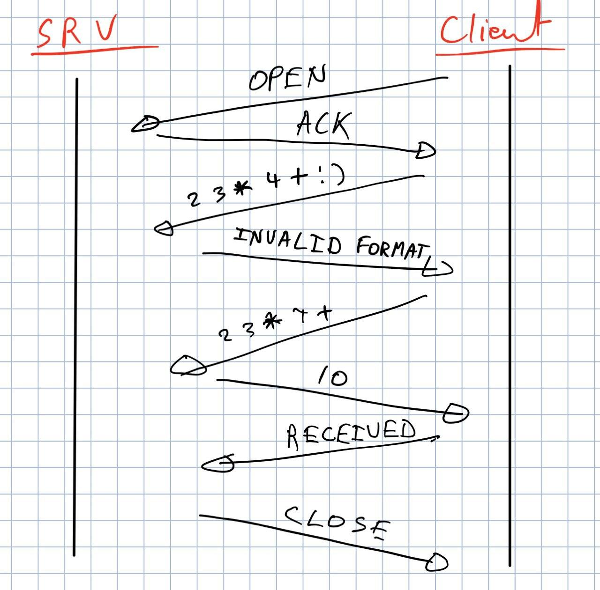

Protocole 			: TCP
Adresse du serveur 	: localhost
Port du serveur		: 50000

Le client prend contact avec le serveur en premier.

Flow

Le client établit une connexion avec le serveur ("OPEN")
Serveur répond affirmativement à la demande ("OPENED") et en
profite pr sauver les infos de contct du client
Le client envoie le calcul en notation polonaise inverse (forme 2 3 * 4 +)
Si mauvais format, serveur envoie ("INVALID FORMAT")
Le serveur retourne le résultat (un int) ou si erreur ("ERROR") de math
Le client répond ("RECEIVED")
Le serveur clôt la connexion ("CLOSED")

