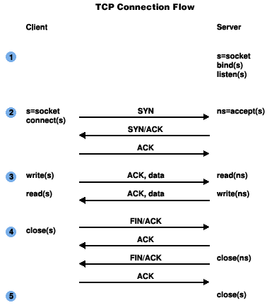

# Protocol

* Transport protocol : TCP
* Adredress and port : `10.192.91.10:220`
* Speaks first : Client
* Flow :

* Semantics :
  * The message is decoded with utf8
  * Send a proper response back
* Syntax :
  `Message {CONNECTION|COMPUTE|END} [Operation] [val1] [val2]`
* Closed by : Client 