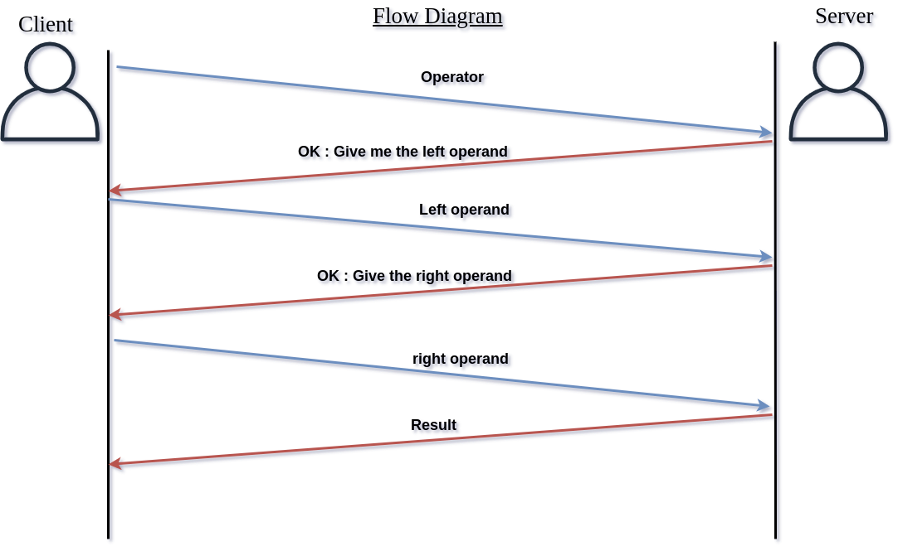

# RES Protocol Specification

```
Authors : Sinyks & Brassens
```


## Phase 1

1. What transport protocol do we use?

* __We will use TCP__

2. How does the client find the server (addresses and ports)?
* __IPdest:__ splinux-XPS, __portdest__ : 2020

  __But for the tests we will use the loop back address (127.0.0.1)__

3. Who speaks first?
* __The client__

4. What is the sequence of messages exchanged by the client and the server? (flow)
* __The client sends 3 messages: the operator, the left operand and the right operand. The server confirms each messages asking for the left operand, the right operand or simply answers with the result once he received the 3 necessary messages.__

  

  


5. What happens when a message is received from the other party? (semantics)
* __see answer above__

6. What is the syntax of the messages? How we generate and parse them? (syntax)
* __we send ASCII characters, with a maximum of 100 bytes, ended by the null character ('\0'). e.g. "*\0", "42\0"__

7. Who closes the connection and when?
* __The client closes the connection. The server always listen to whatever he receives.__
