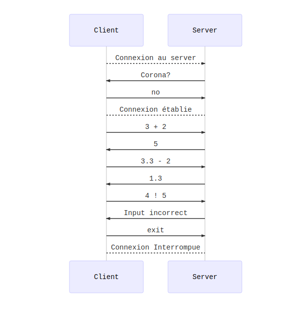

## Specifications du protocole Corona

### Protocole utilisé

Le protocole utilisera TCP pour le transport des paquets. 

### Adresse et port

**Port écouté:** 666

### Flow, semantique et interruption de communication

C’est le client qui initie la communication. Lorsque la connexion est établie, le client peut envoyer un calcul à une seule opération à effectuer. 

Le calcul se trouve être sous la forme: *Operande1 <Opération> Operande2*

Cette forme est spécifiée par le serveur au client lorsqu’une connexion est correctement établie.

**Liste des opérations:**

- Addition / Soustraction
- Multiplication / Division

Le serveur lui va alors effectuer le calcul demandé et renvoyer le résultat si le calcul est valide. Le serveur reste alors en attente d’un autre calcul. Le serveur est simplement threadé.

Si le client envoie un *exit*, alors la connection est interrompue.

**Exemple d’interaction**

